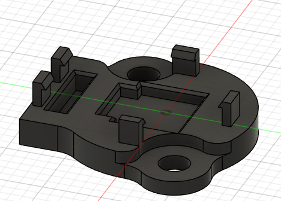
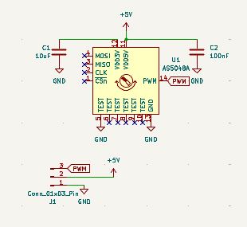
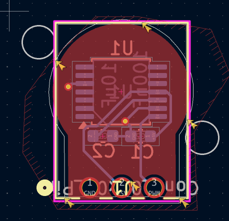
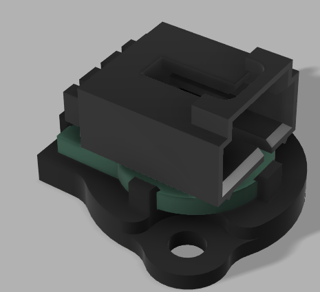

# Magnetic Encoder

## Overview
This project is a custom magnetic encoder designed to act as a drop-in replacement for the CTRE CANCoder.  
The goal was to swap the encoder in without redesigning mounts or assemblies.

The encoder uses the AS5048A magnetic encoder IC and outputs PWM, making it easy to integrate with the roboRIO.

---

## Component Selection
- AS5048A magnetic encoder IC
  - High-resolution rotation sensing
  - Built-in PWM output
- PWM was chosen over SPI or CAN:
  - roboRIO has limited SPI ports
  - Long SPI wires are unreliable
  - CAN has complex circurity
  - CAN requires custom low-level code (Maybe next time)

---

## Case CAD
The bottom case was designed to closely match the CANCoder’s geometry.

- Two mounting holes match the CANCoder
- PCB is retained using snap-in clips

---

## PCB Schematic

---

## PCB Layout

---

## Case + PCB Assembly

---

## BOM

| Item | Quantity | Unit Cost (CAD) | Total Cost (CAD) | Supplier | Link |
|-----|----------|------------------|------------------|----------|------|
| Molex SL Connector (70553-0002) | 3 | 1.34 | 13.97 | Digi-Key | https://www.digikey.ca/en/products/detail/molex/0705530002/114955 |
| Custom PCB | 1 | 23.24 | 23.24 | JLCPCB | — |
| Diametric Cylinder Magnet (5 mm × 12 mm) | 3 | 1.25 | 17.27 | Magnet Montreal | https://magnetmontreal.com/neodymium-cylinder-magnets/cylinder-diametric-magnet-5mm-wide-x-12mm-high-0.2-x-0.47.html |
| Total:| — | — | — | 54.64 CAD | 39.63  USD |

*Total cost includes shipping
